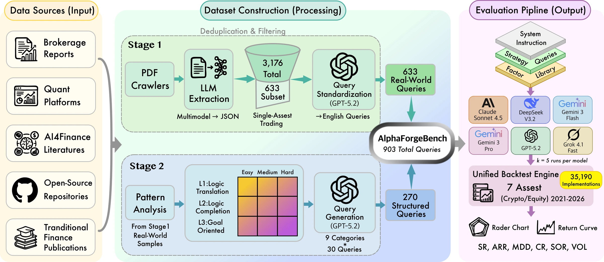

# AlphaForgeBench: Benchmarking End-to-End Trading Strategy Design with Large Language Models

<p align="center">
  <a href="https://arxiv.org/abs/2602.18481"></a>
  <a href="https://huggingface.co/datasets/finbrain-lab-hkustgz/AlphaForgeBench-data"></a>
  <a href="https://finbrain-lab-hkustgz.github.io/AlphaForgeBench/"></a>
  <a href="LICENSE"></a>
</p>



## Abstract

The rapid advancement of Large Language Models (LLMs) has catalyzed the proliferation of diverse financial benchmarks, progressively evolving from static knowledge evaluation to increasingly sophisticated interactive trading simulations. Nevertheless, existing frameworks that assess real-time trading performance largely overlook a fundamental failure mode: the severe behavioral instability exhibited by LLMs in sequential decision-making under financial uncertainty. Through extensive empirical investigation, we demonstrate that when deployed as direct trading agents, LLMs manifest extreme run-to-run variance, produce inconsistent action sequences even under strictly deterministic decoding configurations, and exhibit irrational action flipping across temporally adjacent decision steps. We introduce AlphaForgeBench, a principled evaluation framework that reconceptualizes the role of LLMs from stochastic execution agents to quantitative researchers capable of systematic financial reasoning. Rather than requiring models to emit discrete trading actions, AlphaForgeBench tasks LLMs with generating executable alpha factors and composing factor-based trading strategies grounded in financial domain knowledge. Extensive experiments demonstrate that AlphaForgeBench effectively eliminates execution-induced instability and provides a rigorous benchmark for assessing financial reasoning, strategy formulation, and alpha discovery.

---

This repository contains the code, data pipeline, and reference results for the benchmark.
In short, each model is asked to produce executable factor/strategy code for a set of curated
queries; the code is then extracted, validated, **backtested on real market data**, and scored
with **Pass@k** together with standard financial metrics (Sharpe, Sortino, Calmar,
max-drawdown, annualized return, …).

## Highlights

- **270 benchmark queries** across 9 difficulty buckets (`L1/L2/L3` × `easy/medium/hard`, 30 each).
- **Multi-model, multi-sample** evaluation (Pass@k, configurable `k`).
- **Real backtests** on 7 assets — crypto (BTCUSDT, ETHUSDT) and equities (AAPL, GOOGL, MSFT, NVDA, TSLA), daily bars, 2021–2026.
- **Sandboxed execution** of model-generated code (import whitelist + restricted builtins).
- Ships **reference result sets** (`bench_t=0`, `bench_t=0.7`) so you can compare your runs.

This release is the paper's **structured benchmark** (270 difficulty-specialized queries),
evaluated at two temperatures and backing **Table 2** of the paper. Reference
code-generation success (Pass@k, k = 5, 6 models):

| | Pass@k | Pass@1 | Syntax pass |
|---|---|---|---|
| T = 0.0 | **0.9969** | 0.9790 | 0.9817 |
| T = 0.7 | **0.9994** | 0.9673 | 0.9767 |

The per-model / per-level / per-asset **financial metrics** (Sharpe, annual return,
max-drawdown, Calmar, Sortino, volatility) — i.e. the contents of the paper's **Table 2** —
are in `AlphaForgeBench/benchmark_results/bench_t={0,0.7}/summary_metrics.json`.

> **Scope vs. the paper.** The paper additionally reports a *real-world validation track*
> (633 single-asset queries, **Table 1**) built on a curated, proprietary strategy corpus.
> That track is **not** part of this open-source release; the released benchmark is the
> reproducible structured track and its results (Table 2 and Tables 14–18).

## Repository layout

```
AlphaForgeBench/                 # repo root — run all commands from here
├── AlphaForgeBench/             # the benchmark package
│   ├── benchmark.py             #   end-to-end driver (samples → extract → validate → backtest → metrics)
│   ├── query_batch_generator.py #   stage 1: generate benchmark queries with an LLM
│   ├── api_caller.py            #   stage 2: sample model answers (async, cached)
│   ├── code_extractor.py        #   parse strategy/factor code out of model responses
│   ├── factor_validator.py      #   validate / compute factors against the dataset
│   ├── backtest_runner.py       #   sandboxed backtest engine + metric aggregation
│   ├── metrics.py               #   Pass@k and financial-metric computation
│   ├── run_backtest.py          #   standalone re-backtest of saved samples
│   ├── configs/                 #   benchmark_config.json, generation_config.json
│   ├── prompts/system_prompt.txt
│   ├── generated_queries/       #   the curated query set used by the benchmark
│   └── benchmark_results/        #   reference results: bench_t=0/ and bench_t=0.7/
├── src/                         # supporting library (datasets, factors, strategies, metrics, env, models)
├── configs/                     # data-preparation configs (download / process)
├── examples/                    # data-preparation entry scripts
├── scripts/                     # helpers: download_data.py, generate_features.py, compute_factor_stats.py
├── docs/                        # project website (GitHub Pages)
├── datasets/                    # market data — downloaded from the Hugging Face Hub (not in git)
├── requirements.txt             # dependencies
└── .env.template
```

> **Note** — the benchmark package imports the supporting `src/` library, so the two are
> shipped together and commands are run from the repository root.

## Installation

```bash
# 1. Create an environment (Python 3.10+; 3.12 recommended)
conda create -n alphaforge python=3.12 -y
conda activate alphaforge

# 2. Install dependencies
pip install -r requirements.txt

# 3. Configure secrets
cp .env.template .env
# then edit .env and set OPENROUTER_API_KEY=...
```

`.env` keys:

| Variable | Used for |
|---|---|
| `OPENROUTER_API_KEY` | LLM query generation and answer sampling (OpenRouter) |
| `HF_API_KEY` | optional — only to download a private dataset repo or push data |

## Data

The market dataset (~140 MB) and the example model answers / per-query metrics live on the
Hugging Face Hub, not in git. Download them into the repo:

```bash
python scripts/download_data.py
# or a custom repo:  python scripts/download_data.py --repo-id <org>/<dataset-name>
# behind a firewall? use the mirror:  HF_ENDPOINT=https://hf-mirror.com python scripts/download_data.py
```

This populates:

```
datasets/market/
├── market_price_1day/      # daily OHLCV per symbol (BTCUSDT.jsonl, …, TSLA.jsonl)
├── market_feature_1day/    # daily factor-feature matrix per symbol
├── factor/                 # factor definitions (factor.json) + contract
├── meta_info.json          # dataset manifest (symbols, tags, factor names)
└── meta_info_auto.json
AlphaForgeBench/benchmark_results/bench_t={0,0.7}/
├── extracted_codes.json    # the model answers — strategy/factor code per sample (8100 each)
└── query_metrics.json      # per-query financial metrics
```

## Quick start — run the benchmark

Generate fresh model answers and score them (requires `OPENROUTER_API_KEY` and the dataset):

```bash
# full pipeline: sample answers → extract code → validate factors → backtest → Pass@k
python -m AlphaForgeBench.benchmark --backtest

# pick models / sample count explicitly
python -m AlphaForgeBench.benchmark \
  --models "openrouter/gpt-5.2,openrouter/claude-sonnet-4.5" \
  --samples 5 --temperature 0.0 --backtest
```

Results are written to `AlphaForgeBench/benchmark_results/bench_<timestamp>/`. Compare your
`results.json` against the shipped `bench_t=0/results.json`.

> **Factor validation mode.** By default the benchmark is *permissive*: factors a model uses
> that are not in the base dataset are computed on the fly (via `meta_info_auto.json`). This is
> how the published reference results (`bench_t=0`, `bench_t=0.7`) were produced, so the default
> run is directly comparable to them. Pass `--strict` to instead restrict to the base
> `meta_info.json` factor set and treat unknown factors as errors.

Common flags (`AlphaForgeBench.benchmark`): `--config`, `--models`, `--samples`,
`--temperature`, `--backtest`, `--strict`, `--resume auto`, `--retry-failed`, `--no-cache`,
`--query-file`, `--max-concurrent`.

## Full pipeline

### 1. Generate queries (`create-dataset`)

```bash
python -m AlphaForgeBench.query_batch_generator
```

Reads `AlphaForgeBench/configs/generation_config.json` (difficulty levels, categories,
styles, allowed factors) and writes a query set under
`AlphaForgeBench/generated_queries/<model>_<timestamp>/`. Supports checkpoint/resume.
The benchmark uses the curated subset `generated_queries_filtered_top30.json`.

### 2. Prepare market data (`prepare-dataset`, optional)

The ready-to-use dataset is provided on the Hub (step *Data* above). To re-fetch and
re-compute the **crypto** portion from Binance yourself:

```bash
bash examples/run_download.sh    # download raw OHLCV (Binance public API)
bash examples/run_process.sh     # compute factor features + meta_info
```

> The equity symbols (AAPL/GOOGL/MSFT/NVDA/TSLA) are provided as static pre-built data and
> are not reproduced by the Binance pipeline.

### 3. Re-score published answers (optional)

Re-backtest a saved answer set **without calling any LLM**. The published `bench_t=0` /
`bench_t=0.7` ship their `extracted_codes.json`, so you can reproduce their `results.json` /
`summary_metrics.json` directly:

```bash
python -m AlphaForgeBench.run_backtest \
  --extracted-codes AlphaForgeBench/benchmark_results/bench_t=0/extracted_codes.json \
  --allow-compute-factors --workers 4
```

**What `--extracted-codes` means:** it takes a JSON array of already-parsed answers — each
`{query_id, model, sample_id, strategy_code, factor_codes}`. `run_backtest` then skips the
sample-loading and code-extraction stages and goes straight to *factor validation → backtest →
metrics*. This is the quickest way to reproduce the shipped scores from the shipped answers.

> Alternatively, `--samples-dir <dir>` re-scores a directory of **raw** per-sample response
> files (the form a `benchmark.py` run writes to `bench_<timestamp>/samples/`); it runs the
> extraction step itself.

Useful flags: `--workers`, `--pass-count N`, `--symbol BTCUSDT`, `--allow-compute-factors`,
`--clear-cache`, `--retry-errors`.

## Results format

A reference result set (`bench_t=0/`, `bench_t=0.7/`) contains:

```
bench_t=0/
├── benchmark_config.json   # config snapshot
├── system_prompt.txt       # exact system prompt used
├── results.json            # Pass@k / Pass@1 / syntax-pass-rate (by model / level / overall)
├── summary_metrics.json    # financial metrics — Sharpe/ARR/MDD/CR/Sortino/VOL
│                           #   by model × {overall, level, asset}  ← the paper's Table 2
├── invalid_factors.json    # report of unknown/invalid factors
├── extracted_codes.json    # the model answers — strategy/factor code, 8100  (on the Hub)
└── query_metrics.json      # per-query financial metrics                     (on the Hub)
```

`results.json` and `summary_metrics.json` are committed to git; `extracted_codes.json` and
`query_metrics.json` are downloaded from the Hub (`scripts/download_data.py`).

## Configuration

Edit `AlphaForgeBench/configs/benchmark_config.json`:

| Field | Meaning |
|---|---|
| `models` | LLMs to evaluate (OpenRouter ids) |
| `num_samples` | `k` in Pass@k |
| `temperature` | sampling temperature |
| `query_levels` | difficulty buckets to evaluate |
| `query_file` | curated query set |
| `backtest.symbols` | assets to backtest |
| `backtest.data_path` | dataset directory (`datasets/market`) |
| `backtest.start_ts` / `end_ts` / `history_ts` | backtest window and warm-up length |

## Citation

If you find **AlphaForgeBench** useful in your research, please consider citing our paper:

```bibtex
@inproceedings{zhang2026alphaforgebench,
  title     = {AlphaForgeBench: Benchmarking End-to-End Trading Strategy Design with Large Language Models},
  author    = {Zhang, Wentao and Zhao, Mingxuan and Gao, Jincheng and You, Jieshun and Jia, Huaiyu and Zhao, Yilei and An, Bo and Sun, Shuo},
  booktitle = {Proceedings of the 32nd ACM SIGKDD Conference on Knowledge Discovery and Data Mining (KDD '26)},
  year      = {2026}
}
```

## License

See [LICENSE](LICENSE).
